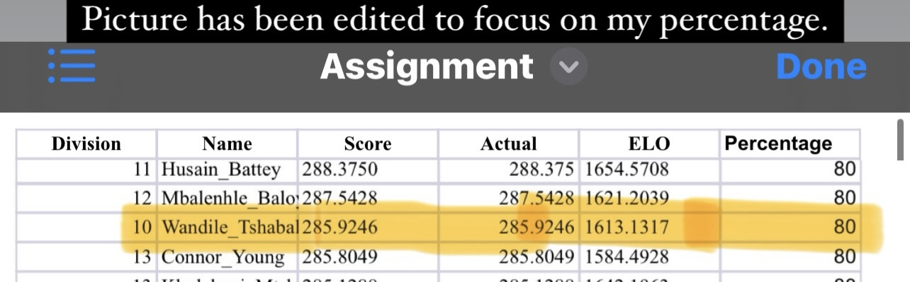
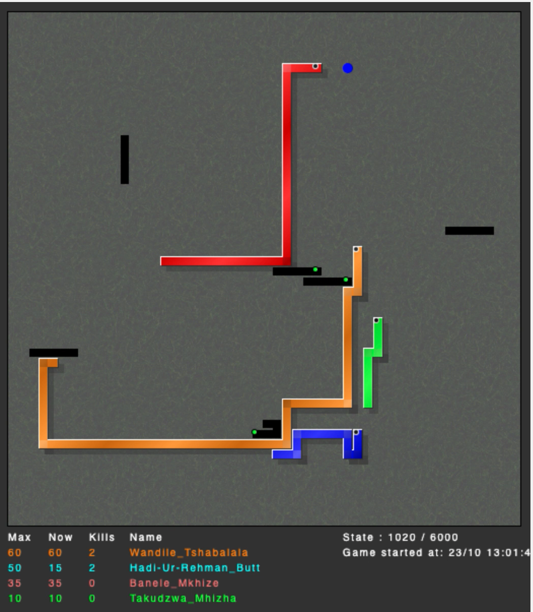

# Snake AI - 1st Place Winner 🐍🥇

This project is my AI snake that recieved 80% in the [Wits Snake AI Competition](https://snake.wits.ai/), outperforming almost all 350+ participants.

## About the AI
- **Language:** The snake is written entirely in Java.
- **Pathfinding:** It uses an enhanced A* algorithm to navigate efficiently on a 2x2 grid.
- **Survival Strategy:** When trapped, the snake switches to a custom Breadth-First Search (BFS) algorithm to maximize survival time.
- **Heuristics:** Includes strategies like moving toward the center of the grid when not closest to the apple.

## Reflection
While the algorithms are efficient and the strategies effective, the code could be improved for better readability. Some lines may appear messy or redundant, and future refinements could focus on maintaining cleaner, more maintainable code.

Feel free to explore and improve upon this project!

